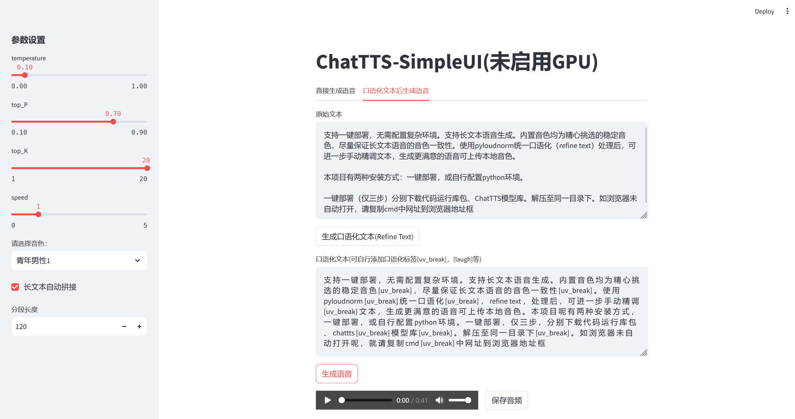
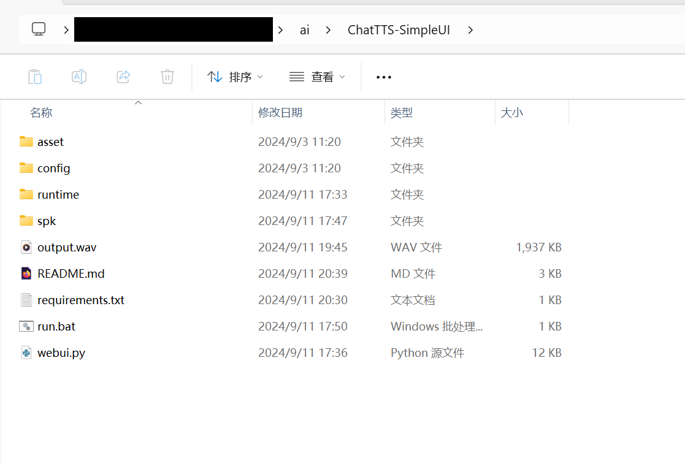

# ChatTTS-SimpleUI

本项目旨在提供一个简易部署的ChatTTS环境和一个简单使用的WebUI。

## UI预览



## 项目特色
- 支持离线一键部署，无需配置复杂环境，无需网络环境
- 支持长文本语音生成
    - 长文本分段生成音频，最后合成
    - 内置音色均为精心挑选的稳定音色，尽量保证各分段音频的音色一致性
    - 使用 pyloudnorm 统一各个分段音频音量
- 口语化（refine text）处理后，可进一步手动精调文本，生成更满意的语音
- 可上传本地音色（*.pt）

## 安装说明
本项目有两种安装方式：一键部署，或自行配置python环境
### 一键部署（仅需三步）
- 分别下载代码运行库包（codes_and_runtime_cpu 或 codes_and_runtime_gpu，二选一）以及ChatTTS模型库（asset）
    - cpu版运行包（[夸克网盘](https://pan.quark.cn/s/472d4ed93a61)或Release中下载[codes_and_runtime_gpu](https://github.com/rguo1988/ChatTTS-SimpleUI/releases/download/v0.1/codes_and_runtime_cpu.7z)），压缩包261M，解压后1.9G
    - gpu版运行包（[夸克网盘](https://pan.quark.cn/s/388841eeacb6)或Release中下载[codes_and_runtime_gpu](https://github.com/rguo1988/ChatTTS-SimpleUI/releases/download/v0.1/codes_and_runtime_gpu.7z)），压缩包1.5G，解压后5.1G。需要Nvidia显卡且显存大于4G，仅支持cudu驱动版本12.1，其他版本可参见以下python环境部署
    - 模型库（[夸克网盘](https://pan.quark.cn/s/be3c00672fbf)或Release中下载[asset](https://github.com/rguo1988/ChatTTS-SimpleUI/releases/download/v0.1/asset.7z)），约1G
- 解压至同一目录下，如下图



- 运行run.bat
    - 如浏览器未自动打开，请复制cmd中网址到浏览器地址框
    - Linux系统下，可参考run.bat代码，运行命令

### python环境部署
- 创建conda新环境，并激活
    ```
    conda create --name chattts-simpleui
    ```
- 安装python依赖
    ```
    pip install -r requirements.txt
    ```
- 若想使用 GPU 版，则重新安装 GPU 版 torch，参见 [PyTorch 官网](https://pytorch.org/get-started/locally/)
    ```
    # 以cuda 12.1版为例
    pip install torch torchvision torchaudio --index-url https://download.pytorch.org/whl/cu121
    ```
- 下载[模型库](https://pan.quark.cn/s/be3c00672fbf)。若未下载，则在第一次运行时，自动联网下载
- 使用 streamlit 运行 webui.py
    ```
    streamlit run webui.py
    ```

## 使用说明
- 两种生成语音的方式：直接生成，口语化处理后生成。ChatTTS的口语化处理（refine text）有时并不完美，本项目可在自动口语化处理的基础上，再次手动完善，最后生成音频。可添加停顿 `[uv_break]` 和笑声`[laugh]`。
- 参数设置
    - temperature: 随机性（0-1）。越大每次生成音频的语气、节奏、音色等因素的随机性越强。
    - top_P: 多样性（0.1-0.9）。将token的概率从小到大开始丢弃，直到已丢弃token的累计概率和达到top_P。越大多样性程度越大。
    - top_K: 多样性（1-20）。仅考虑概率最高的top_K个token。越大多样性程度越大。
    - speed: 音频速度（0-5）。越大说话速度越快。
    - 音色: 固定音色来自于ChatTTS-Speaker。自定义音色需自行设置seed，具体参见[ChatTTS里的说明](https://github.com/2noise/ChatTTS?tab=readme-ov-file)。
    - 长文本自动拼接：由于ChatTTS目前最多只能生成30s长的音频，因此长文本依据字数被分割为多个片段依次生成音频，最后合成一整段。注意音频速度较慢时，应适当调小分段长度。

## 待解决问题
- 长文本分段生成音频时，音色仍有略有变化
- 添加zero shot功能
- 自定义口语化处理控制参数

## References
- ChatTTS：[https://github.com/2noise/ChatTTS?tab=readme-ov-file]
- ChatTTS-ui：[https://github.com/jianchang512/ChatTTS-ui?tab=readme-ov-file]
- ChatTTS-Speaker: [https://modelscope.cn/studios/ttwwwaa/ChatTTS_Speaker]
- Pyloudnorm：[https://github.com/csteinmetz1/pyloudnorm]
- python嵌入式打包：[https://www.zhihu.com/question/48776632/answer/2336654649]
